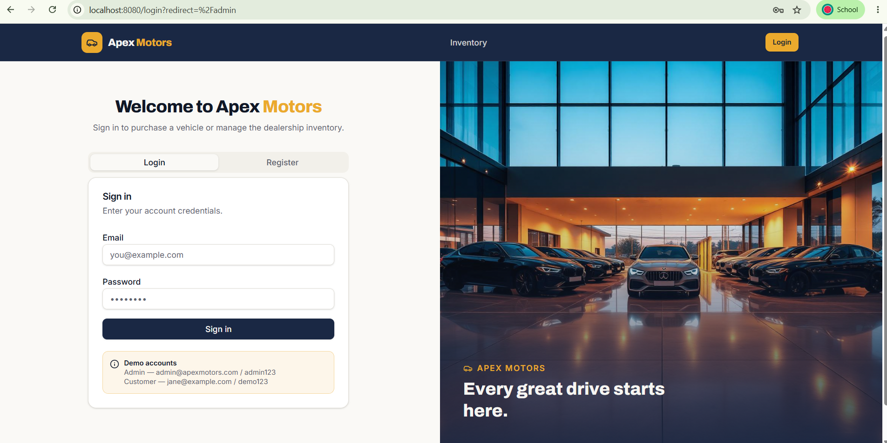
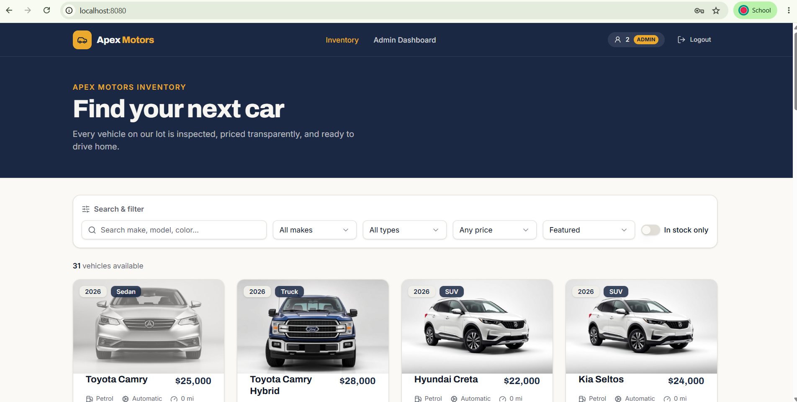
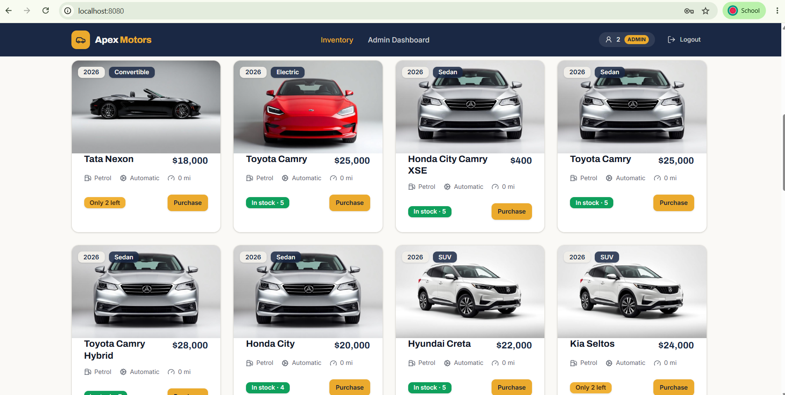
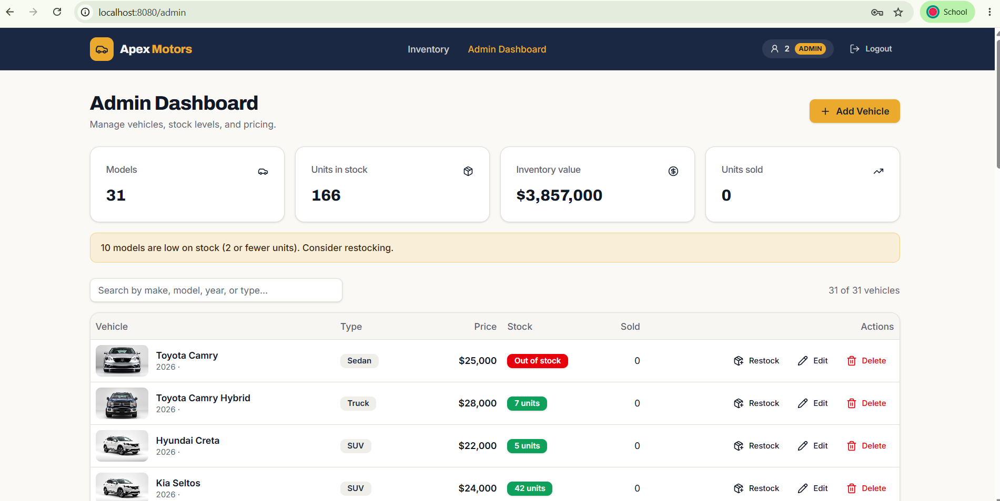
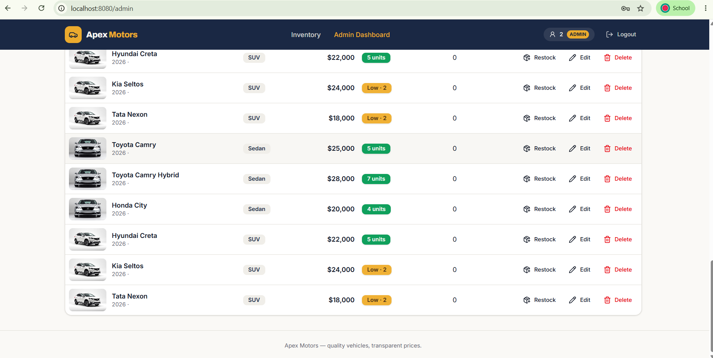
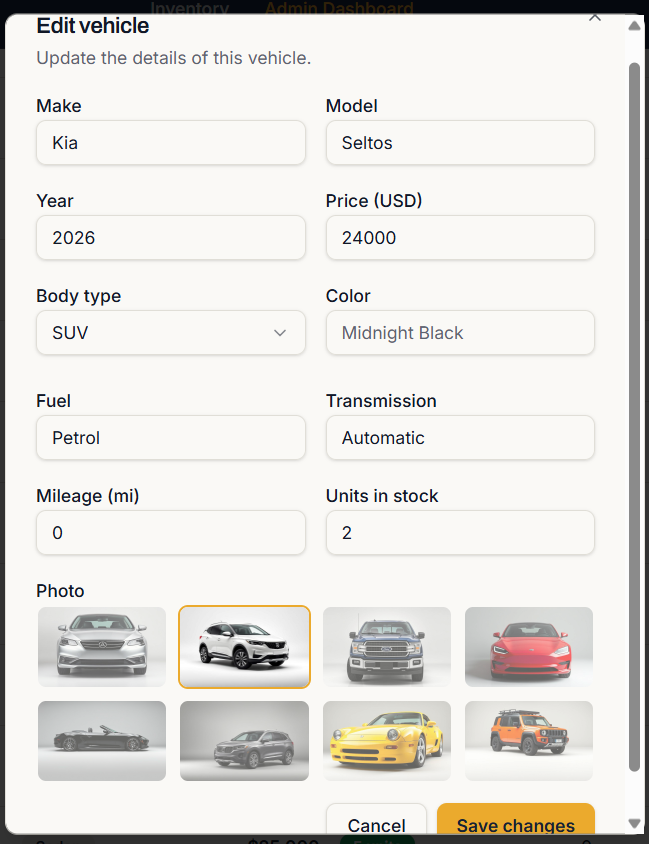
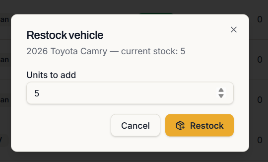
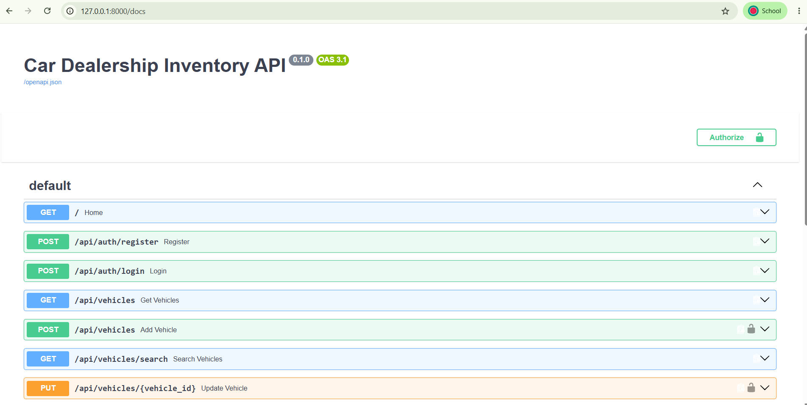
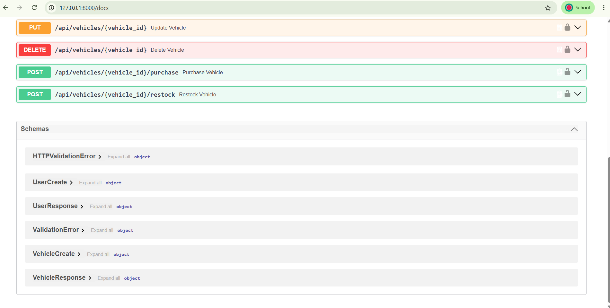
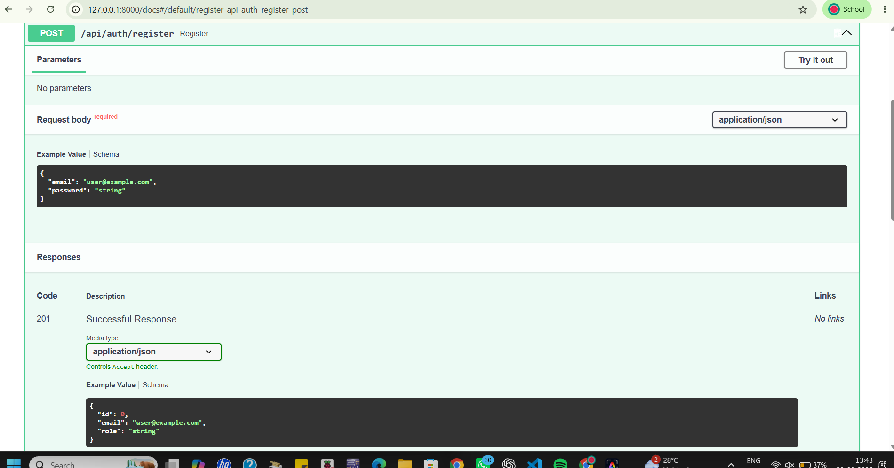

# Apex Motors – Car Dealership Inventory System

A full-stack web application for managing a car dealership inventory.

The system allows customers to browse and purchase available vehicles, while administrators can manage vehicles, stock levels, pricing, and inventory operations through a dedicated admin dashboard.

---

## 1. Project Overview

The Car Dealership Inventory System provides a centralized platform for managing dealership vehicles and inventory.

The application consists of:

- React-based frontend
- FastAPI REST backend
- SQLite database
- SQLAlchemy ORM
- JWT-based authentication
- Role-based authorization
- Automated backend testing using Pytest

The system supports two primary roles.

### Customer

Customers can:

- Register an account
- Log in
- Browse available vehicles
- Search vehicles
- Filter vehicles
- View vehicle information
- Purchase available vehicles

### Administrator

Administrators can:

- Log in securely
- View the admin dashboard
- Add vehicles
- Edit vehicle information
- Delete vehicles
- Restock vehicles
- Monitor inventory levels
- View stock and sales information

---

## 2. Key Features

### Authentication

- User registration
- User login
- JWT authentication
- Password-based authentication
- Role-based authorization
- Customer and administrator access control

### Vehicle Management

- Add vehicles
- View all vehicles
- Search vehicles
- Update vehicle information
- Delete vehicles
- Purchase vehicles
- Restock vehicles

### Inventory Management

- Track units in stock
- Track purchased/sold units
- Identify low-stock vehicles
- Identify out-of-stock vehicles
- Calculate inventory value
- Admin inventory dashboard

### Frontend

- Responsive React interface
- TypeScript
- Tailwind CSS
- Vehicle cards
- Search and filtering
- Admin dashboard
- Add vehicle form
- Edit vehicle form
- Restock interface
- Login and registration interface
- Vehicle image selection

---

## 3. Technology Stack

### Frontend

- React
- TypeScript
- Vite
- Tailwind CSS
- shadcn/ui
- Lucide React

### Backend

- Python
- FastAPI
- SQLAlchemy
- SQLite
- JWT authentication
- Pytest

### Development Tools

- Visual Studio Code
- Git
- GitHub
- Swagger / OpenAPI
- Lovable
- ChatGPT

---

## 4. System Architecture

```text
                    ┌──────────────────────┐
                    │      Customer        │
                    │   / Administrator    │
                    └──────────┬───────────┘
                               │
                               ▼
                    ┌──────────────────────┐
                    │   React Frontend     │
                    │ TypeScript + Tailwind│
                    └──────────┬───────────┘
                               │
                         REST API / HTTP
                               │
                               ▼
                    ┌──────────────────────┐
                    │    FastAPI Backend   │
                    │ Authentication + API │
                    └──────────┬───────────┘
                               │
                               ▼
                    ┌──────────────────────┐
                    │      SQLAlchemy      │
                    │         ORM          │
                    └──────────┬───────────┘
                               │
                               ▼
                    ┌──────────────────────┐
                    │    SQLite Database   │
                    │      dealership.db   │
                    └──────────────────────┘
5. Project Structure
car-dealership-inventory/
│
├── backend/
│   ├── main.py
│   ├── auth.py
│   ├── database.py
│   ├── models.py
│   ├── schemas.py
│   ├── requirements.txt
│   │
│   └── tests/
│       ├── test_auth.py
│       └── test_vehicles.py
│
├── frontend/
│   ├── src/
│   ├── public/
│   ├── package.json
│   └── ...
│
├── .gitignore
├── README.md
└── PROMPTS.md

6. Backend API
The backend is implemented using FastAPI and provides RESTful endpoints for authentication and vehicle management.

**Authentication**
**Register**
POST /api/auth/register
Registers a new customer account.

Example request:

{
  "email": "user@example.com",
  "password": "Test1234"
}

Example response:

{
  "id": 1,
  "email": "user@example.com",
  "role": "customer"
}

**Login**
POST /api/auth/login

Authenticates a user.

**Vehicle APIs
Get Vehicles**
GET /api/vehicles

Returns the vehicles in the dealership inventory.

**Add Vehicle**
POST /api/vehicles

Adds a new vehicle to the inventory.

**Search Vehicles**
GET /api/vehicles/search

Searches the inventory based on vehicle information.
**
Update Vehicle**
PUT /api/vehicles/{vehicle_id}

Updates an existing vehicle.

**Delete Vehicle**
DELETE /api/vehicles/{vehicle_id}

Deletes a vehicle from the inventory.

**Purchase Vehicle**
POST /api/vehicles/{vehicle_id}/purchase

Purchases a vehicle and decreases the available stock.

**Restock Vehicle**
POST /api/vehicles/{vehicle_id}/restock

Adds units to the inventory.

Restocking is restricted to administrators.

**7. Authentication and Authorization**

The application uses authentication and role-based authorization to protect sensitive operations.

Two roles are supported:

customer
admin

Customers can browse and purchase vehicles.

Administrators can perform inventory management operations such as:

1.Adding vehicles
2.Updating vehicles
3.Deleting vehicles
4.Restocking vehicles

Protected API endpoints require valid authentication and appropriate authorization.

**8. Database**

The backend uses SQLite with SQLAlchemy.

User
id
email
password
role
Vehicle
id
make
model
category
price
quantity

The database provides persistent storage for application data during local execution.

**9. Running the Project Locally**
Prerequisites

Install:

Python 3.12+
Node.js
npm
Git
**Backend Setup**

Open a terminal and navigate to the backend:

cd backend

Create a virtual environment:

python -m venv venv

Activate it on Windows:

venv\Scripts\activate

Install dependencies:

pip install -r requirements.txt

Start the FastAPI server:

uvicorn main:app --reload --port 8000

The backend will be available at:

http://127.0.0.1:8000
**Swagger API Documentation**

FastAPI provides interactive API documentation.

Open:

http://127.0.0.1:8000/docs

Swagger can be used to test the available REST API endpoints.

**Frontend Setup**

Open another terminal.

Navigate to the frontend:

cd frontend

Install dependencies:

npm install

Start the development server:

npm run dev

The frontend will normally be available at:

http://localhost:8080
**10. Testing**

The backend uses Pytest for automated testing.

The test suite covers:

Authentication
User registration
User login
Vehicle Operations
Add vehicle
Get all vehicles
Search vehicles
Update vehicle
Delete vehicle
Purchase vehicle
Restock vehicle
Authorization
Customer cannot restock vehicles
Customer cannot delete vehicles

Run the complete test suite from the backend directory:
.\venv\Scripts\python.exe -m pytest -v
Final Test Result
11 passed

All implemented automated tests passed successfully.

**11. Test-Driven Development**
Testing was used during development to verify backend functionality.

The test suite was used to identify and fix issues related to:

Authentication
Vehicle creation
Vehicle updates
Inventory operations
Authorization
Customer restrictions

After debugging and corrections, the complete test suite passed successfully.

**12. Screenshots**

The following screenshots demonstrate the main features of the completed application.
## 12. Screenshots

### Home Page

The home page provides the main entry point to the Apex Motors vehicle inventory system.



### Customer Inventory

Customers can browse available vehicles, search the inventory, and filter vehicles by relevant attributes.





### Admin Dashboard

Administrators can monitor inventory statistics, stock levels, inventory value, and vehicle management operations.





### Edit Vehicle

Administrators can update vehicle information including make, model, year, price, body type, color, fuel, transmission, mileage, stock, and vehicle image.



### Restock Vehicle

Administrators can increase the available stock of a vehicle using the restock interface.



### Backend API

The FastAPI backend provides REST API endpoints for authentication and vehicle inventory management.





### Backend Test Results

The automated backend tests validate authentication, vehicle management, inventory operations, and authorization.




**13.Application Flow**
Register
   ↓
Login
   ↓
Browse Inventory
   ↓
Search / Filter Vehicles
   ↓
Select Vehicle
   ↓
Purchase
   ↓
Inventory Stock Decreases

**Administrator Flow**
Login
   ↓
Admin Dashboard
   ↓
View Inventory
   ↓
Add / Edit / Delete Vehicle
   ↓
Restock Vehicle
   ↓
Monitor Stock Levels
**14. AI-Assisted Development**
**My AI Usage**

AI tools were used as development assistants during the project.

**AI Tools Used**
ChatGPT
Lovable
How AI Was Used

AI assistance was used for:

Generating and improving code
Debugging frontend and backend issues
Troubleshooting API integration
Designing UI components
Improving error handling
Creating and debugging automated tests
Understanding FastAPI and React implementation details
Preparing project documentation
Reviewing implementation approaches
Development Process

AI-generated suggestions were reviewed, modified, and tested before being incorporated into the project.

The application was validated through local execution, API testing using Swagger, frontend testing, and automated Pytest tests.

Raw AI prompt logs and relevant AI conversations are documented separately in:

PROMPTS.md
**15. Version Control**

Git and GitHub were used for source-code management.

Development changes were committed using descriptive commit messages.

Repository

https://github.com/prerana-23wh1a0410/car-dealership-inventory

**16. Future Improvements**

Possible future enhancements include:

Production deployment
Cloud database integration
Advanced analytics dashboard
Vehicle image upload
Sales history and reports
Customer purchase history
Pagination for large inventories
Email notifications
Advanced inventory forecasting
17. Conclusion

The Car Dealership Inventory System provides a full-stack solution for managing dealership vehicles and inventory.

The project combines:

React frontend
FastAPI REST API
SQLite database
SQLAlchemy ORM
JWT authentication
Role-based authorization
Automated testing

The final backend test suite contains 11 tests, all of which pass successfully.

The system demonstrates CRUD operations, authentication, authorization, inventory management, search functionality, purchasing, and restocking through an integrated web application.

Submission Repository

GitHub:
https://github.com/prerana-23wh1a0410/car-dealership-inventory


